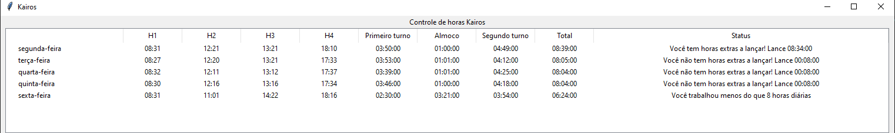

# Coleta de horas Kairos

Esse script tem como objetivo coletar as informações de horas marcadas no sistema Kairos e realizar cálculos em cima delas, para que possa ser lançado corretamente em outras plataformas.

